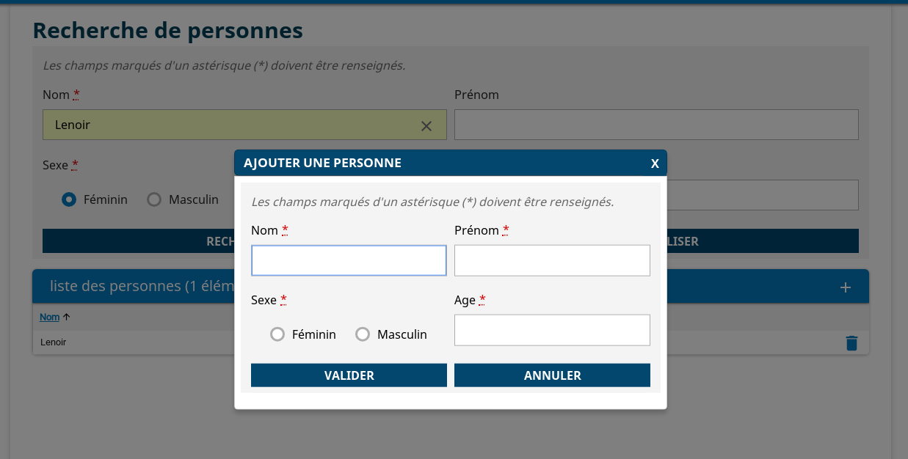

# Exercice 2 : Service Client/Page

## Enoncé
L’objectif de cet exercice est de créer un tableau affichant les résultats de recherche (cf Exercice 1)
- Au clic sur le bouton `Rechercher`, afficher les résultats dans un tableau

- Implémenter un service page qui renvoie un mock des données à afficher

- Ajouter dans la déclaration de la route Page le service Page

- Afficher dans le tableau, les colonnes `Nom`, `Prénom`, `Sexe` et `Age`
Aperçu :



## Astuce
- Utiliser le squelette généré à partir de [la correction de l'exercice 1](https://gitlab01.devng.diplomatie.gouv.fr/gitlab/hornet.js/hornet-js-formation/tree/exercice_1_vue_et_route_lite)
- Créer dans la dossier `src/services/page` un dossier `per`
- Dans le dossier `src/services/page/per`, créer le fichier `per-service.ts` qui contient l'interface du service personne

```
/**
 * Interface du service personne
 */
export interface PersonneService {
    rechercherPersonnes(data): Promise<any>;
}

/**
 * Définition du type de l'objet utilisé par la vue
 */
export interface Personne {
    identifiant : number;
    nom : string;
    prenom: string;
    sexe: string;
    age: number;
    description: string
}

```

- Créer dans le dossier `src/services/page/per`, le fichier `per-service.impl.ts` qui contient l'implémentation du service personne

```
import { Utils } from "hornet-js-utils";
import { Logger } from "hornet-js-utils/src/logger";
import { ServicePage } from "hornet-js-core/src/services/service-page";
import { PersonneService, Personne } from "src/services/page/per/per-service";


// mock à retourner à la vue
const personnes = [
    {
        "identifiant": 1,
        "nom": "Lebon",
        "prenom": "Julien",
        "sexe": "M",
        "age": 28,
        "description": ""
    },
    {
        "identifiant": 2,
        "nom": "Trebern",
        "prenom": "Gilles",
        "sexe": "M",
        "age": 66,
        "description": ""
    },
    {
        "identifiant": 3,
        "nom": "Clam",
        "prenom": "Juliette",
        "sexe": "F",
        "age": 28,
        "description": ""
    },

    {
        "identifiant": 4,
        "nom": "Durant",
        "prenom": "Jacqueline",
        "sexe": "F",
        "age": 58,
        "description": ""
    },

    {
        "identifiant": 5,
        "nom": "Beat",
        "prenom": "Axel",
        "sexe": "M",
        "age": 55,
        "description": ""
    },

    {
        "identifiant": 6,
        "nom": "Beat",
        "prenom": "Axelle",
        "sexe": "F",
        "age": 55,
        "description": ""
    },

    {
        "identifiant": 7,
        "nom": "Lebrun",
        "prenom": "Adrien",
        "sexe": "M",
        "age": 29,
        "description": ""
    },

    {
        "identifiant": 8,
        "nom": "Dupont",
        "prenom": "Jack",
        "sexe": "M",
        "age": 28,
        "description": ""
    },

    {
        "identifiant": 9,
        "nom": "Doe",
        "prenom": "Jean",
        "sexe": "M",
        "age": 28,
        "description": ""
    },
    {
        "identifiant": 10,
        "nom": "Lenoir",
        "prenom": "Adeline",
        "sexe": "F",
        "age": 28,
        "description": ""
    }
];


/**
 * Implémentation de l'interface PersonneService
 */
export class PersonneServiceImpl extends ServicePage implements PersonneService {

    /**
     * Recherche les personnes repondant aux critères en entrée
     * @param data : critère de recherche
     */
    rechercherPersonnes(data: any): Promise<any> {
        return Promise.resolve(personnes);
    }

}

```

- Utiliser les composants `Table` `Columns`, `Column`, `Content`, pour générer le tableau dans le ficher `per-form-page.tsx`

