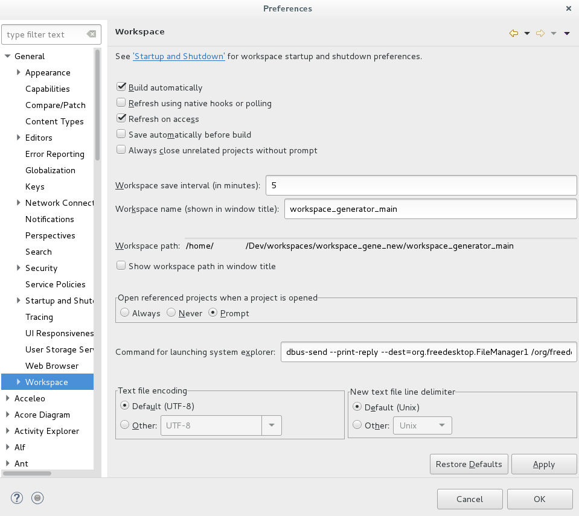

# Installation de l'environnement hornet-services

## Installation du jdk8
Avant de procéder à l'installation, vérifier que si le jdk est déjà installé sur le poste

`
java --version
`
Si la version 1.8.x n'est pas installée, procéder à son installation :

`
apt-get install openjdk-8-jdk
`

## Installation de tomcat
La version de Tomcat utilisée dans la v5.2.0 du framework est la 8.5 :
- Télécharger cette version depuis le site [apache mediamirrors]: https://apache.mediamirrors.org/tomcat/tomcat-8/v8.5.33/bin/
- Dézipper le contenu dans un répertoire par exemple Dev/tools

## Installation de maven

La version de maven utilisée dans la v5.2.0 du framework est la 3.3.9 :
- Télécharger cette version depuis le site [apache]: http://apache.mirrors.ovh.net/ftp.apache.org/dist/maven/maven-3/3.3.9/binaries/
- Dézipper le contenu dans un répertoire par exemple Dev/tools

## Installation de l'IDE Eclipse Neon
- Télécharger Eclipse Néon sur le site [eclipse]: http://www.eclipse.org/downloads/download.php?file=/technology/epp/downloads/release/neon/3/eclipse-jee-neon-3-linux-gtk-x86_64.tar.gz 
- Dézipper le contenu du fichier dans un répertoire par exemple Dev/tools

### Configuration Eclipse
Dans cette section, nous allons effectuer la configuration Maven et java d'Eclipse:

#### Configuration du jre
- Choisir le menu Window > Preferences puis sélectionner Java > Installed JREs
- Cliquer sur Add
- Choisir Standard VM puis Next
- Renseigner le champ JRE home en sélectionnant le répertoire d’installation du JDK :

- Cliquer sur Finish

#### Configuration de maven
- Choisir le menu Window > Preferences puis sélectionner Maven > Installations
- Cliquer sur Add
- Renseigner le champ Installation home en sélectionnant le répertoire d'installation de Maven 3.3.9 :

- Cliquer sur Finish

#### Ajout du server tomcat
- Choisir le menu Window > Preferences puis sélectionner - Server > Runtime Environnements
- Cliquer sur Add
- Choisir Apache Tomcat 8.5 puis Next
- Choisir le nom par défaut Apache Tomcat v8.5, - renseigner le champ Tomcat installation directory en sélectionnant le répertoire d’installation de Tomcat puis choisir la JRE.

- Cliquer sur Finish

#### Configuration de l'encodage
- Eclipse permet de spécifier le format d'un fichier : sous Windows, vérifier que l'encodage défini pour le workspace est bien UTF-8 dans la fenêtre Window > Preferences, puis rubrique General > Workspace, option Text File Encoding.
- De la même manière, pour forcer le format de fin de ligne en mode Unix, sur le même écran, vérifier l’option New text file line delimiter, à positionner sur Unix
